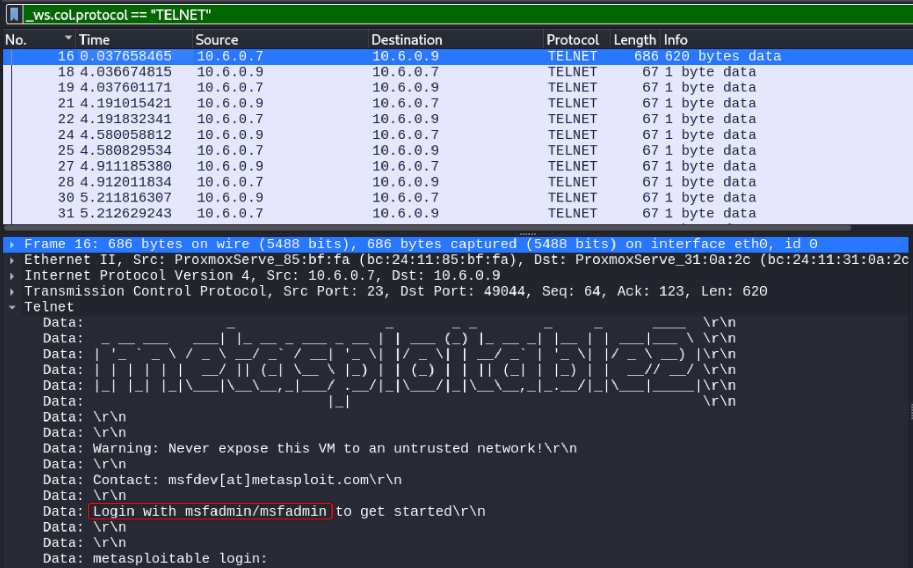
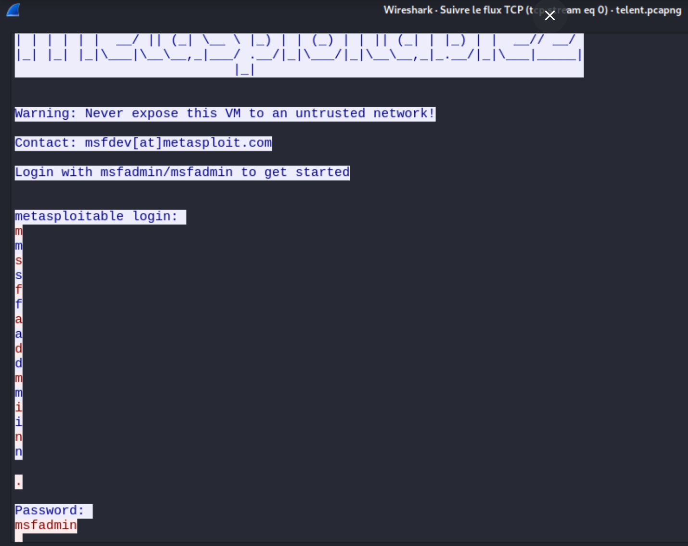

# Capture du mot de passe et analyse du trafic réseau venant du protocole non chiffré Telnet sur Metasploitable 2 avec Wireshark:

1. **Lancer Wireshark et capturer le trafic**
  - Filtrage du trafic Telnet dans Wireshark pour ne voir que ce protocole spécifique.

2. **Effectuer une connexion Telnet à Metasploitable 2**
   - Depuis la machine d'attaque, connexion à Metasploitable 2 via Telnet en utilisant la commande suivante :
     ```bash
     telnet 10.6.0.7
     ```
   - Saisissez le nom d'utilisateur et le mot de passe.

3. **Récupération du nom utilisateur et du mot de passe dans les paquets capturés** <br>
 <br>



### Remarques:
   - Comme Telnet n'utilise pas de chiffrement, toutes les informations transmises peuvent être vues par toute personne ayant accès au trafic réseau. C'est pourquoi Telnet est considéré comme peu sécurisé et est largement remplacé par SSH.

## Recommandation de sécurité
- Désactiver le service Telnet
- bloquer le port 23 avec le pre-feu
- Utiliser SSH à la place de Telnet
